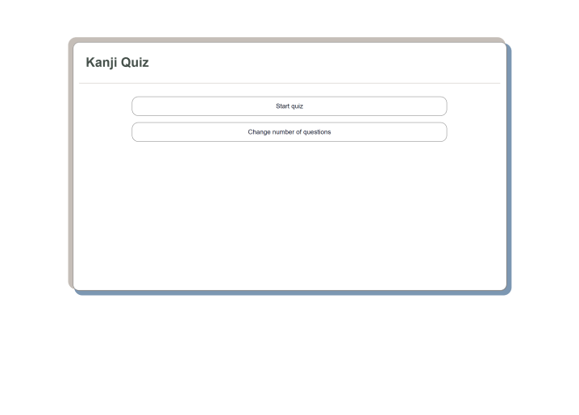
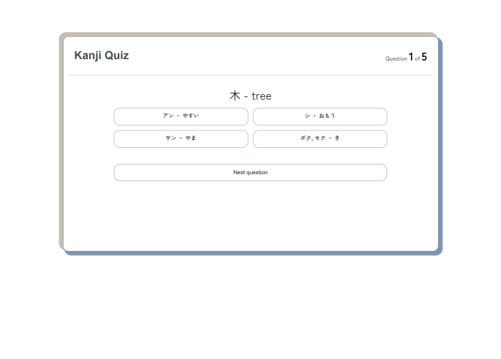
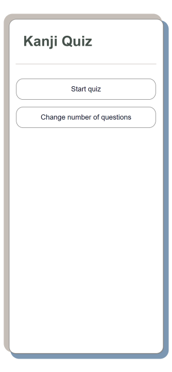
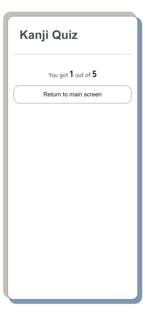
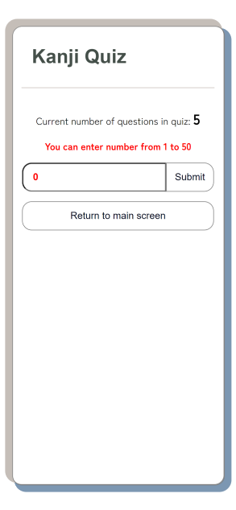
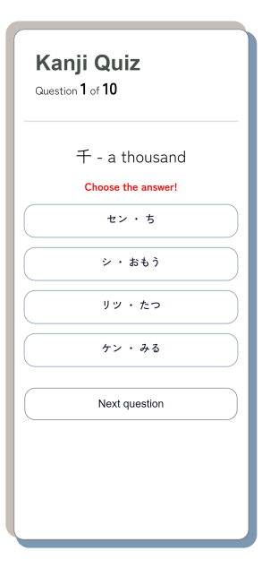

# Kanji Quiz

Quiz to learn Kanji. HTML/CSS/JS
Questions are loaded from json file randomly. 
There are 51 kanji of N5 level in file now.
You can change number of questions in quiz (1-50 questions). 
After completing the quiz you will see the number of correct answers.
There is error message for the scenario when no answer is chosen.
Adaptive design for mobile and desktop devices.

+ *[View it in action]()*
+ *[View code]()*

